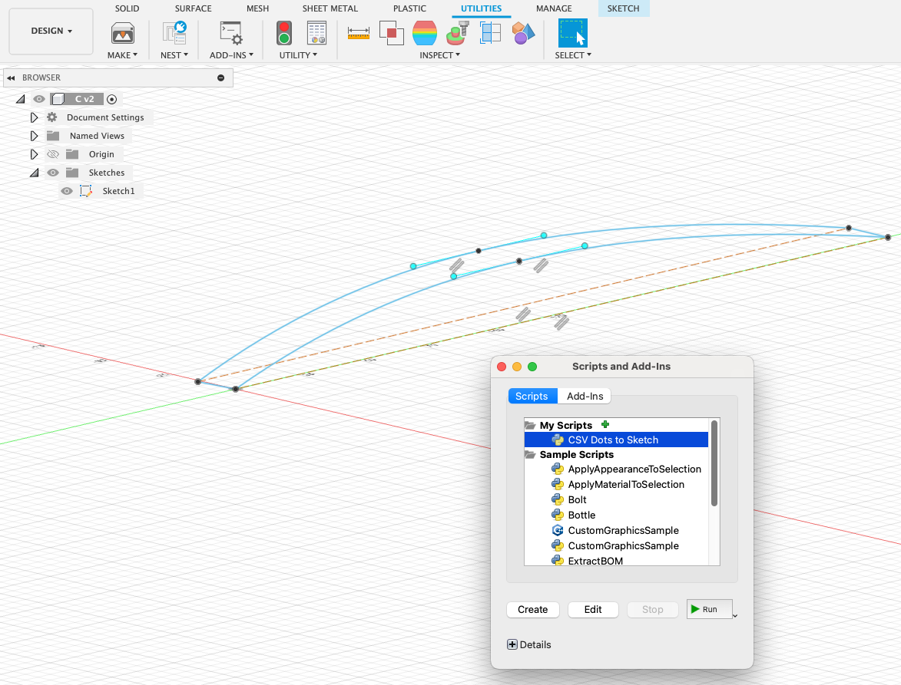
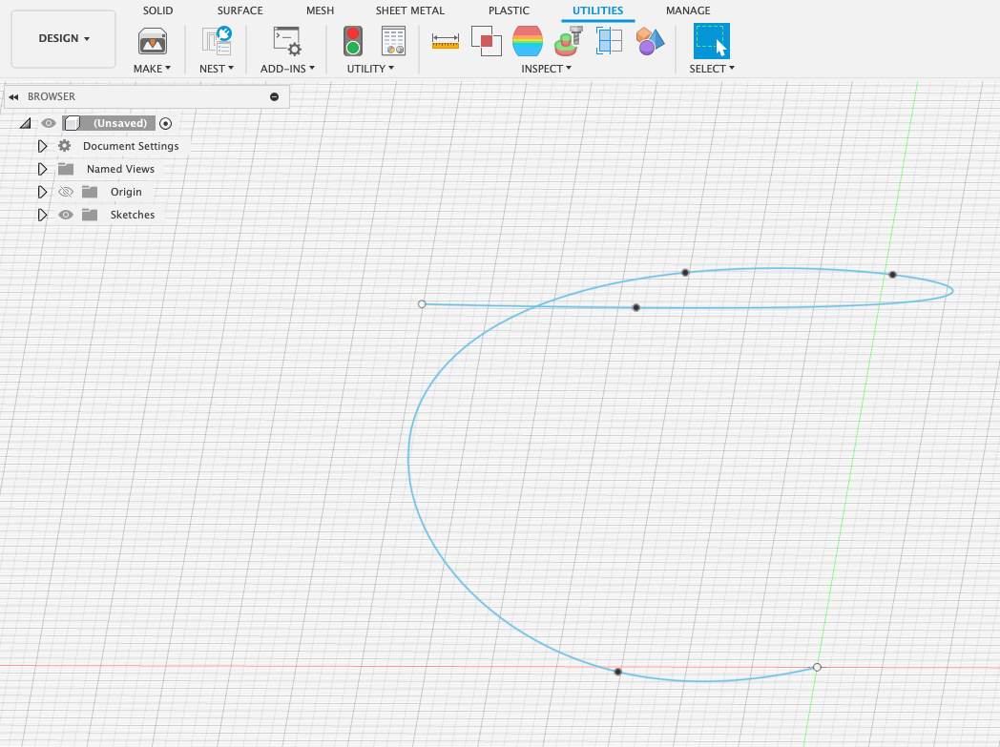
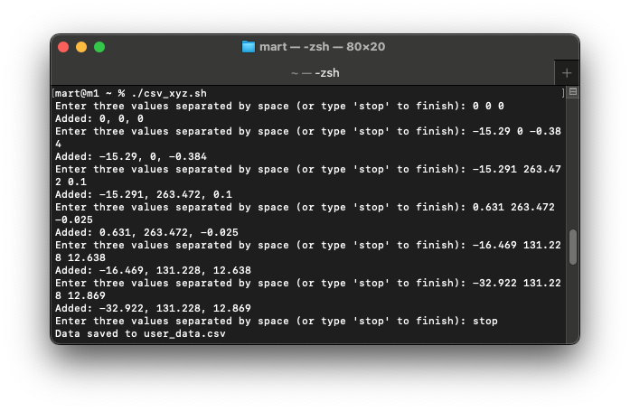

# Fusion 360 CSV Point Importer
A Python add-in for Autodesk Fusion 360 that creates a sketch with points based on coordinates from a CSV file. The add-in reads `x`, `y`, and `z` coordinates from a user-selected CSV file and places points in the Fusion 360 sketch accordingly.



## Features
- Prompts the user to select a CSV file with point coordinates.
- Creates points in a new sketch on the XY plane.
- Supports automatic unit conversion (e.g., from millimeters to centimeters).

## Prerequisites
- **Autodesk Fusion 360** installed.
- **Python** is pre-installed with Fusion 360, so no additional Python setup is needed.

## CSV Format
The CSV file should contain columns labeled `x`, `y`, and `z`, representing the coordinates of each point. Here’s an example format:

```csv
x,y,z
10,20,0
15,25,0
20,30,0
```

## Installation
1.	Clone or Download this repository to your local machine.
2.	Open Autodesk Fusion 360 and navigate to Tools > Add-Ins.
3.	Select the Scripts and Add-Ins option, then load this script as an Add-In.

## Usage
1.	Go to Tools > Add-Ins in Fusion 360, and run the create_points_from_csv.py script.
2.	A file selection dialog will appear. Select your CSV file.
3.	The script will read the coordinates from the CSV file and create points in a new sketch on the XY plane.

## Configuration
•	The script includes a conversion_factor variable, which is set to 0.1 to convert coordinates from millimeters to centimeters (Fusion 360’s default unit).
•	If your data is in a different unit, adjust conversion_factor accordingly.

## Troubleshooting
•	File Not Selected: If no file is selected, the script will stop with a notification.
•	Incorrect Scaling: Adjust conversion_factor if points are not appearing at the expected scale.
•	CSV Format Issues: Ensure the CSV file uses x, y, and z headers and numeric values.

## Why?
There is an ImportSplineCSV script ootb, but ~~sometimes~~ more often you don't need a spline, just dots.


# CSV Creator Script
A simple shell script for macOS that prompts the user to enter data and saves it in a CSV file. Each line of data contains three values, separated by spaces, which are then stored in a comma-separated format in the resulting CSV file.



## Features
- Prompts the user to enter three values per line.
- Allows the user to continue entering data until they type "stop" to end the process.
- Saves the data to a CSV file named `user_data.csv` in the script’s directory.
- Adds headers (`x`, `y`, `z`) to the CSV file automatically.

## Usage
1. Clone this repository or download the `create_csv_xyz.sh` script.
2. Open a terminal and navigate to the directory containing `create_csv_xyz.sh`.
3. Make the script executable by running:

   ```bash
   chmod +x create_csv_xyz.sh

4.	Run the script:

    ```bash    
    ./create_csv_xyz.sh

5.	Enter three values separated by spaces when prompted. Continue entering values, or type stop to finish and save the data.

## Example
    Enter three values separated by space (or type 'stop' to finish): 0 0 0
    Added: 0, 0, 0
    Enter three values separated by space (or type 'stop' to finish): -15.29 0 -0.384
    Added: -15.29, 0, -0.384
    Enter three values separated by space (or type 'stop' to finish): -15.291 263.472 0.1
    Added: -15.291, 263.472, 0.1
    Enter three values separated by space (or type 'stop' to finish): 0.631 263.472 -0.025
    Added: 0.631, 263.472, -0.025
    Enter three values separated by space (or type 'stop' to finish): -16.469 131.228 12.638
    Added: -16.469, 131.228, 12.638
    Enter three values separated by space (or type 'stop' to finish): -32.922 131.228 12.869
    Added: -32.922, 131.228, 12.869
    Enter three values separated by space (or type 'stop' to finish): stop
    Data saved to user_data.csv

## Output
The script generates a file named user_data.csv in the current directory. An example of the output file:

    x,y,z
    0,0,0
    -15.29,0,-0.384
    -15.291,263.472,0.1
    0.631,263.472,-0.025
    -16.469,131.228,12.638
    -32.922,131.228,12.869

## Requirements
- macOS (or any Unix-based OS with bash).


## License
This project is licensed under the MIT License. See the [LICENSE](../LICENSE) file for details.

## Contributing
Contributions are welcome! Please open an issue or submit a pull request with any improvements.
